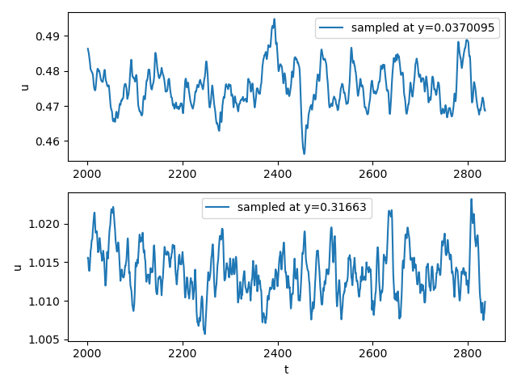

# Time series data of turbulent channel flow at $Re_\tau=298$

saleh.rezaeiravesh@manchester.ac.uk

* Turbulent channel flow simulation is performed by Nek5000, see [Rezaeiravesh et al., 2021](https://www.sciencedirect.com/science/article/pii/S0045793021001900).

* Number of samples: 104377
* Sampling locations: $y/\delta$ ranging from 0 (wall) to 1 (channel centre). There are 64 sampling points.
* Quantity: streamwise velocity `u` (averged over wall-parallel planes $xz$) at 64 wall-normal locations `y`. The velocity samples are normalized by $U_b$, the bulk velocity. 
* $\Delta t = 0.008$ -- normalized by $\delta/U_b$ where $\delta$ is the channel half-height.

## Data
Data are located in `./chan300/`:
* `t`: time stamps (size = 104377)
* `y`: wall-normal distance of the sampling points (size: 64)
* `u`: streamwise velocity samples averaged over the wall-parallel planes at `y`. The array of `u` has the size of 104377 x 64.
* `uTau`: samples of wall friction velocity (size=104377).
